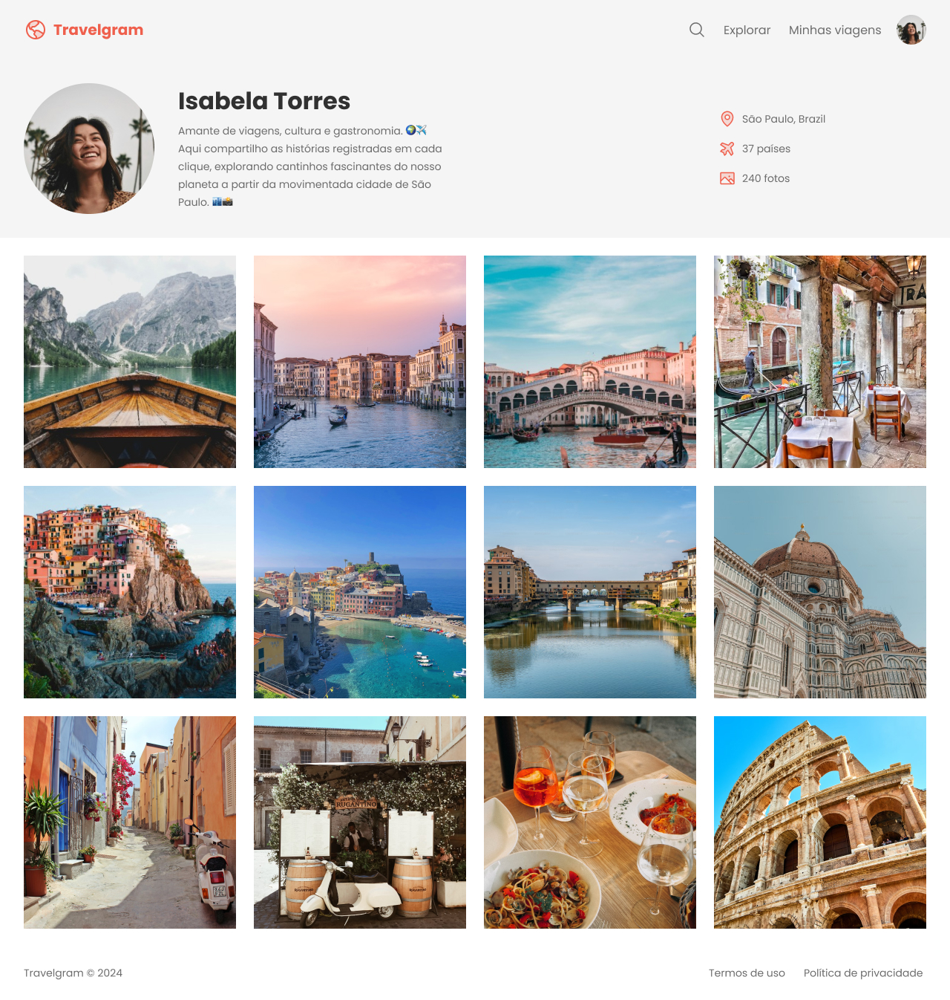

# 🗺️ Travelgram

Este projeto foi desenvolvido para praticar o uso do `display: flex` e explorar suas possibilidades de organização de layout. Ele consiste em uma página inspirada em um feed de viagens, apresentando uma interface moderna e estilizada com HTML e CSS.

## 🌍 Visão Geral

A página representa o perfil de uma viajante fictícia, destacando:
- Informações pessoais e de viagens.
- Galeria de fotos dispostas em um grid flexível.
- Design responsivo com ênfase na organização e alinhamento dos elementos utilizando **Flexbox**.

## 🗂️ Estrutura do Projeto

```
|-- index.html        # Página principal do projeto
|-- styles/
    |-- index.css     # Estilo principal
    |-- global.css     # Estilo global para reset e variáveis
    |-- nav.css     # Estilo da navegação
    |-- header.css     # Estilo do cabeçalho
    |-- main.css     # Estilo da galeria principal
    |-- footer.css     # Estilo do rodapé
|-- assets/           # Pasta contendo os icones e as imagens utilizadas
    |-- images/
        |-- Image 01.png
        |-- Image 02.png
        |-- ...
    |-- icons/
        |-- AirplaneTilt.svg
        |-- MapPin.svg
        |-- ...
    |-- Logo.svg
    |-- profile-pic.png
```

## 🔍 Como Visualizar

Para visualizar a página em seu navegador, siga estas etapas:

1. Faça o download ou clone este repositório:
   ```bash
   git clone https://github.com/DevDeividMoura/travelgram.git 
   ```
2. Navegue para dentro do projeto:
   ```bash
   cd travelgram
   ```
3. Abra o arquivo `index.html` em qualquer navegador para visualizar a página.

## 🖼️ Demonstração

Veja abaixo uma prévia da página final:



## 💻 Tecnologias Utilizadas

- **HTML**: Para estruturação semântica da página.
- **CSS (Flexbox)**: Para estilização e organização de layouts.

## 🎯 Objetivo

O objetivo principal deste projeto é praticar:
- Praticar o uso de Flexbox para criar layouts flexíveis.
- Explorar alinhamento e distribuição de elementos.
- Melhorar a organização de arquivos e estilos.
- Utilizar boas práticas de desenvolvimento e versionamento com Commits Convencionais.

## 🤝 Contribuições

Contribuições e sugestões são sempre bem-vindas! 😊

---

**Desenvolvido por [Deivid Moura](https://github.com/DevDeividMoura)**

